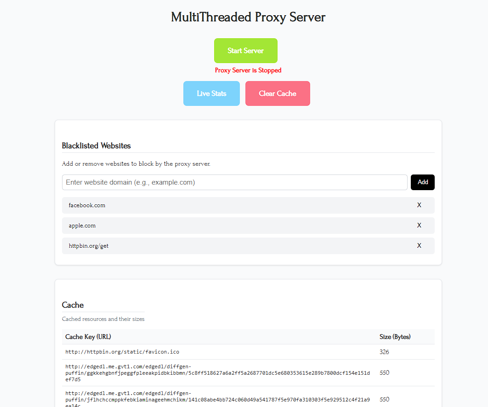
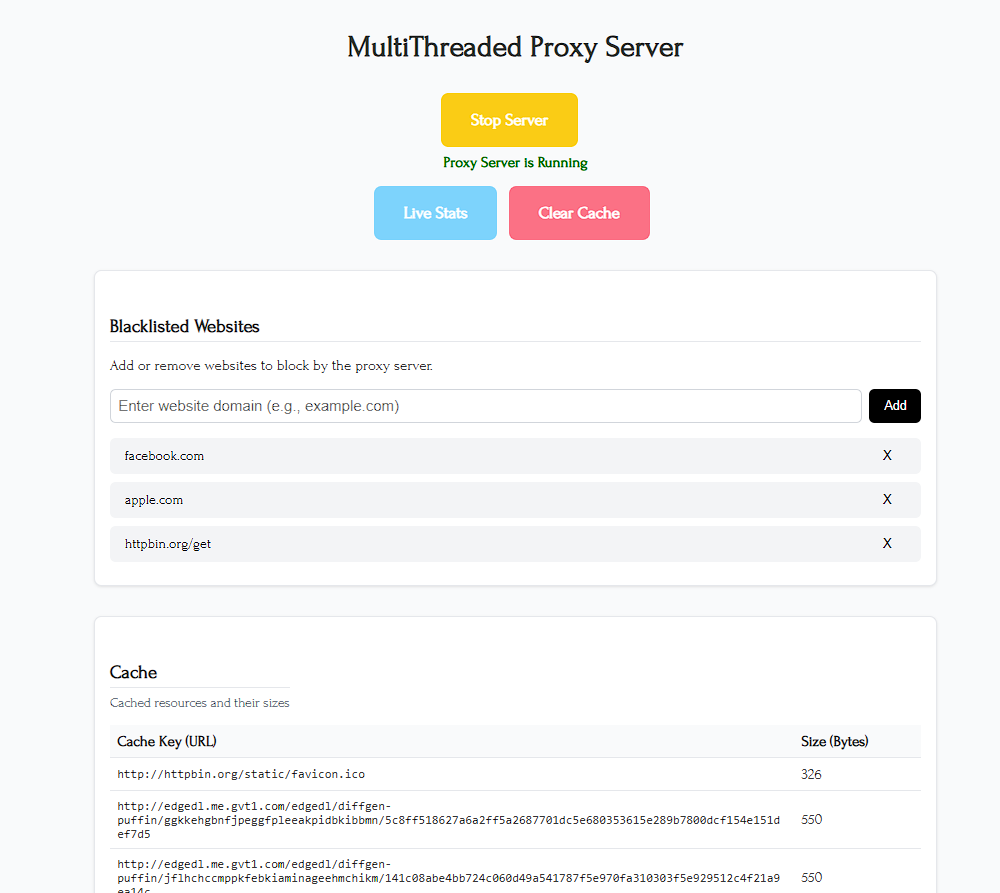
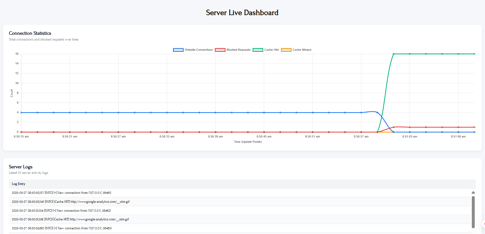
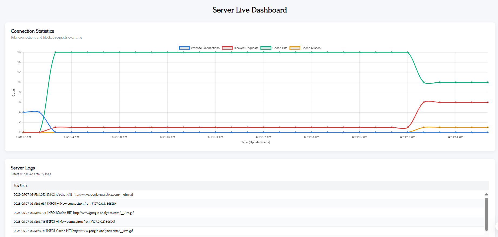

# Multi-Threaded Proxy Server

A Python-based multi-threaded proxy server designed to efficiently handle multiple client requests concurrently, minimize response times using caching, block unwanted domains via regex, and monitor activity through a real-time dashboard.

## 🔥 Key Features

- ✅ Multi-threaded client request handling using `threading`
- 💾 LRU Caching System using `OrderedDict`
- 📜 Regex-based website blacklisting
- 📈 Real-time web dashboard with live charts using Flask + Socket.IO
- 🧠 Smart URL normalization for cache efficiency
- 🛠 Configurable via `settings.json`
- 🪵 Logging with thread-safe handlers

---

## 🧠 Project Abstract

This project emulates the key features of real-world proxy servers like content delivery networks (CDNs) and reverse proxies in a simplified educational format. It uses multi-threading for concurrency, LRU caching to optimize network performance, and a Flask-based dashboard for live monitoring. Security is enforced through domain blacklisting and all activity is logged in real time.

---

## 🧩 Project Structure

```
Multi-Threaded-Proxy-Server-main/
│
├── cache.pkl                # Serialized cache file (runtime)
├── cache.py                 # Caching logic with LRU eviction
├── config.py                # Loads JSON configuration
├── dashboard.py             # Flask + Socket.IO dashboard (web app)
├── handler.py               # Handles client requests & cache logic
├── logger.py                # Logging setup
├── main.py                  # Entry point to run the proxy server only
├── server.py                # TCP socket server
├── settings.json            # Config file
├── proxy.log                # Logs proxy activities
├── proxy_dash.log           # Logs dashboard activities
├── templates/
│   └── dashboard.html       # Dashboard HTML with live charts
└── __pycache__/             # Python compiled cache
```

---

## ⚙️ Configuration

Settings are managed via `settings.json`:

```json
{
  "proxy_host": "127.0.0.1",
  "proxy_port": 8888,
  "dashboard_host": "127.0.0.1",
  "dashboard_port": 5000,
  "cache_file": "cache.pkl",
  "log_file": "proxy.log"
}
```

Update the values to match your environment.

---

## 🚀 How to Run

1. Clone the repository:

   ```bash
   git clone https://github.com/DeepakSingh0027/Multi-Threaded-Proxy-Server
   cd Multi-Threaded-Proxy-Server
   ```

2. Install dependencies:

   ```bash
   pip install flask flask_socketio
   ```

3. Configure your system to use the proxy server. Depending on your OS:

   - **Windows**: Go to Settings > Network & Internet > Proxy and set `127.0.0.1:8888`.
   - **macOS**: System Preferences > Network > Advanced > Proxies.
   - **Linux**: Update environment variables or network settings.

4. Ensure `settings.json` is configured correctly.

5. Run the proxy server (only server):

   ```bash
   python main.py
   ```

6. Run the dashboard (in a separate terminal having full functionalities):
   ```bash
   python dashboard.py
   ```

- Proxy Server starts on `127.0.0.1:8888`
- Dashboard is live at `http://127.0.0.1:5000`

---

## 🌐 Dashboard

The dashboard provides real-time:

- Request logs
- Cache hits/misses
- Blocked website attempts
- Live charts (via Chart.js)
- Cache entries
- Edit Blacklisted Websites

📍 Visit: `http://127.0.0.1:5000`

---

## 📷 Photos

### Dashboard UI

| Screenshot 1                     | Screenshot 2                     |
| -------------------------------- | -------------------------------- |
|  |  |

### Real-Time Graphs

| Screenshot 1                  | Screenshot 2                  |
| ----------------------------- | ----------------------------- |
|  |  |

## ✅ Completed Tasks

- ✅ Multi-threaded Proxy Server
- ✅ LRU Caching with OrderedDict
- ✅ Request Parsing & Logging
- ✅ Regex-based Blacklisting
- ✅ Dashboard with Flask + Socket.IO
- ✅ Smart Cache Key Generator
- ✅ Enhanced Testing & Benchmarking

---

## 🧪 Testing Status

| Test Type                     | Status     | Notes                           |
| ----------------------------- | ---------- | ------------------------------- |
| Functional Testing            | ✅ Pass    | All modules functional          |
| Performance Testing           | ✅ Pass    | Stable under load               |
| Cache Consistency Tests       | ✅ Pass    | Thread-safe & correct           |
| Logging & Monitoring          | ✅ Pass    | Verified with concurrency       |
| Security & Blacklist Testing  | ✅ Pass    | Regex filters work              |
| Real-Time Sync (API/SocketIO) | ⚠️ Partial | SocketIO works with minor delay |

---

## 🧾 Logs

- `proxy.log`: HTTP request details, cache info
- `proxy_dash.log`: Dashboard events, real-time stats

---

## 📦 Deliverables

- Python-based Multi-Threaded Proxy Server
- LRU Caching System
- Real-Time Dashboard
- Website Blacklisting System
- Normalized Cache Key Strategy
- Complete Documentation & Presentation

---

## 🧑‍💻 Technologies Used

- Python 3.10+
- `socket`, `threading`, `collections`, `logging`, `re`
- Flask + Flask-SocketIO
- Chart.js (for dashboard visualization)

---

## 🛠 Challenges Overcome

- ✅ Thread synchronization with `threading.Lock`
- ✅ Logging in a multi-threaded environment
- ✅ Regex blacklisting without false positives
- ✅ Cache key normalization to reduce redundancy
- ✅ Real-time UI sync via Socket.IO

---

## 📌 Repository

- GitHub: [DeepakSingh0027/Multi-Threaded-Proxy-Server](https://github.com/DeepakSingh0027/Multi-Threaded-Proxy-Server)
- Primary Branch: `main`

---

## 📝 License

MIT License

Copyright (c) 2025

Permission is hereby granted, free of charge, to any person obtaining a copy
of this software and associated documentation files (the "Software"), to deal
in the Software without restriction, including without limitation the rights
to use, copy, modify, merge, publish, distribute, sublicense, and/or sell
copies of the Software, and to permit persons to whom the Software is
furnished to do so, subject to the following conditions:

The above copyright notice and this permission notice shall be included in all
copies or substantial portions of the Software.

THE SOFTWARE IS PROVIDED "AS IS", WITHOUT WARRANTY OF ANY KIND.
